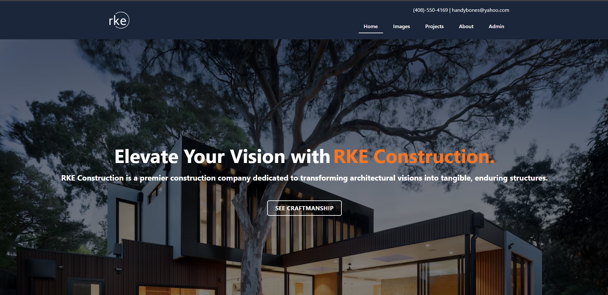

# RKE Construction Website

## Description
- Small business website used to commercialize products and services from RKE Construction Company.
- Website: [https://www.erniepineda.com](https://www.erniepineda.com)

## Functionalities
- Customized image search operations with infinite scrolling
- Admin user authentication/authorization using JWT webtokens
- Image upload/edit using CRUD/REST API
- Variable zoom/panning of selected image
- Contact company using Web3Forms 

## Techonologies
- Backend API: [NEXT14](https://nextjs.org/blog/next-14)
- Frontend Library: [React](https://react.dev/)
- Frontend Framework: [Bootstrap](https://getbootstrap.com/)
- SQL Langauge: [PostgreSQL](https://www.postgresql.org/)
- SQL ORM: [Prisma](https://www.prisma.io/)
- Cloud Storage: [Cloudinary](https://cloudinary.com/)
- SQL Database Host: [Supabase](https://supabase.com/)
- Access Management: [Jwt](https://jwt.io/) 
- Hosting Server: [Vercel](https://vercel.com/)

